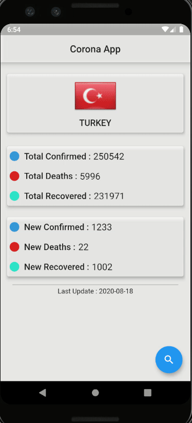

# Covid-19 Flutter App

#### This project is made using Flutter framework.In this app you can check the daily count of covid-19 cases of every country.

# Libraries

- [http](https://pub.dev/packages/http)
- [shared_preferences](https://pub.dev/packages/shared_preferences)
- [cached_network_image](https://pub.dev/packages/cached_network_image)
- [flutter_launcher_icons](https://pub.dev/packages/flutter_launcher_icons)
- [flutter_material_picker](https://pub.dev/packages/flutter_material_pickers)

Note: Tested on android devices only.
